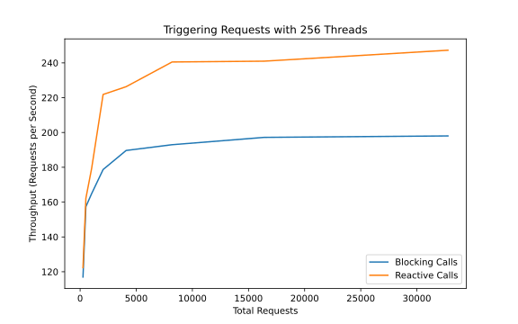

# Spring Webflux vs. MVC Benchmark
Performance benchmark comparing Spring Webflux with Spring Mvc

The following figure shows the throughput in requests per second when processing 
the total amount of request with 256 threads in a blocking or reactive way.

